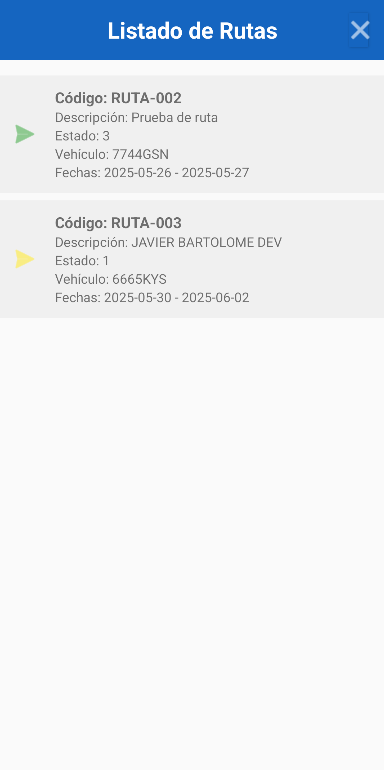

# Albarthnos Mobile

## Introducción
Albarthnos Mobile es una aplicación diseñada para facilitar la gestión y seguimiento de rutas asignadas a los usuarios. Además de consultar información relevante sobre cada ruta, la aplicación permite realizar el seguimiento de las paradas y de los pedidos asociados a cada parada. De este modo, se optimiza el control de entregas y la eficiencia del flujo de trabajo desde dispositivos móviles Android. La aplicación está orientada a mejorar la eficiencia y la comunicación dentro del equipo de trabajo.

## Índice
- [Introducción](#introducción)
- [Manual de Usuario - APP Móvil](#manual-de-usuario---app-móvil)
  - [Instalación](#instalación)
  - [Inicio de Sesión](#inicio-de-sesión)
  - [Funcionalidades principales](#funcionalidades-principales)
    - [Listado de Rutas](#listado-de-rutas)
    - [Listado de Paradas](#listado-de-paradas)
    - [Listado de Pedidos](#listado-de-pedidos)
  - [Notas](#notas)
  - [Soporte](#soporte)

## Manual de Usuario - APP Móvil

### Instalación
1. Descarga el archivo APK desde el repositorio o desde la tienda correspondiente.
2. Instala la aplicación en tu dispositivo Android (requiere Android 7.0 o superior).
3. Asegúrate de tener conexión a Internet para el correcto funcionamiento.

### Inicio de Sesión

  
  
<em>Login de Usuario</em>

1. Abre la aplicación.
2. Introduce tu usuario y contraseña en la pantalla de inicio de sesión.
3. Pulsa el botón **Iniciar sesión**.
4. Si las credenciales son correctas y tienes permisos, accederás al listado de rutas.
5. Si los datos son incorrectos, aparecerá un mensaje de error.

### Funcionalidades principales

#### Listado de Rutas

  
  
<em>Listado de Rutas</em>

- Tras iniciar sesión, verás un listado de las rutas asignadas.
- Cada ruta muestra:
  - Código de ruta
  - Descripción
  - Estado (con icono de color)
  - Vehículo asignado
  - Fechas previstas de inicio y fin
- Pulsa el botón de cerrar sesión (icono de cerrar en la parte superior) para salir de la aplicación y volver a la pantalla de inicio de sesión.
- Al seleccionar una ruta, accederás al listado de paradas asociadas a esa ruta.
- **Puedes cambiar el estado de la ruta** utilizando los botones disponibles en la parte inferior de la pantalla de la ruta.

#### Listado de Paradas
- Al seleccionar una ruta, se muestra el listado de paradas correspondientes a esa ruta.
- Cada parada muestra:
  - Nombre o identificador de la parada
  - Dirección o ubicación
  - Estado de la parada (con icono de color)
- Puedes seleccionar una parada para ver más detalles y acceder al listado de pedidos asociados a esa parada.
- **Puedes cambiar el estado de la parada** utilizando los botones disponibles en la parte inferior de la pantalla de la parada.

#### Listado de Pedidos
- Al seleccionar una parada, se muestra el listado de pedidos asignados a esa parada.
- Cada pedido muestra:
  - Código o número de pedido
  - Descripción del pedido
  - Estado del pedido (con icono de color)
- Puedes marcar pedidos como entregados o reportar incidencias desde esta pantalla.
- **Puedes cambiar el estado del pedido** utilizando los botones disponibles en la parte inferior de la pantalla del pedido.

---

### Notas
Solo los usuarios activos y con el perfil adecuado pueden acceder.

---

### Soporte

Si tienes problemas o preguntas sobre el uso de la aplicación, contacta con el equipo de soporte técnico a través del correo electrónico **soporte@solinfobartolome.es**.