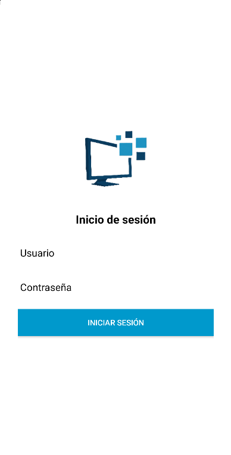
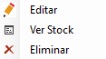
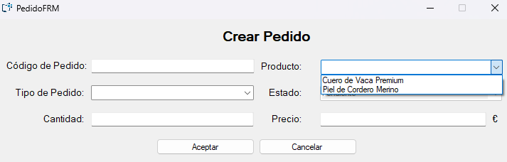

# Albarhnos Desktop

Este documento sirve como manual de usuario para la aplicación **Albarhnos Desktop**, diseñada para la gestión de usuarios, vehículos, almacenes y productos.

## Índice

1. [Introducción](#introducción)
2. [Requisitos del Sistema](#requisitos-del-sistema)
3. [Instalación](#instalación)
4. [Inicio de Sesión](#inicio-de-sesión)
5. [Menú Principal](#menú-principal)
6. [Módulos Disponibles](#módulos-disponibles)
   - [Gestión de Usuarios](#gestión-de-usuarios)
   - [Gestión de Vehículos](#gestión-de-vehículos)
   - [Gestión de Almacenes](#gestión-de-almacenes)
   - [Gestión de Centros de Parada](#gestión-de-centros-de-parada)
   - [Gestión de Productos](#gestión-de-productos)
   - [Gestión de Rutas](#gestión-de-rutas)
     - [Gestión de Paradas](#gestión-de-paradas)
     - [Gestión de Pedidos en Paradas](#gestión-de-pedidos-en-paradas)
7. [Soporte](#soporte)

---

## Introducción

**Albarhnos Desktop** es una aplicación de escritorio desarrollada en Windows Forms que permite gestionar diferentes aspectos de una organización, como usuarios, vehículos y almacenes. Está diseñada para ser intuitiva y eficiente, facilitando la administración de datos.

---

## Requisitos del Sistema

- **Sistema Operativo**: Windows 7 o superior.
- **.NET Framework**: Versión 4.7.2 o superior.
- **Espacio en Disco**: Al menos 100 MB libres.
- **Resolución de Pantalla Recomendada**: 1366x768 o superior.

---

## Instalación

1. Descarga el instalador desde el repositorio o el enlace proporcionado por el administrador.
2. Ejecuta el archivo `.exe` y sigue las instrucciones del asistente de instalación.
3. Una vez instalado, abre la aplicación desde el acceso directo creado en el escritorio.

---

## Inicio de Sesión

1. Al abrir la aplicación, se mostrará la pantalla de inicio de sesión.

2. Introduce tu **usuario** y **contraseña** en los campos correspondientes.
3. Haz clic en el botón **Iniciar Sesión**.
4. Si las credenciales son correctas, accederás al menú principal.

---

## Menú Principal

El menú principal es el punto de partida para acceder a los diferentes módulos de la aplicación. Desde aquí, puedes:

- Navegar a los diferentes módulos de gestión (Usuarios, Vehículos, Almacenes, Productos, Rutas y Centros de Parada).
- Cerrar sesión.

---

## Módulos Disponibles

### Gestión de Usuarios

- Accede al módulo de usuarios desde el menú principal.

  
  
<em>Lista de Usuarios</em>

- Funcionalidades principales:
  - **Crear Usuario**: Haz clic en el botón "Crear Usuario" para añadir un nuevo usuario.

    

     
     
<em>Crear Usuario</em>

    

  - **Editar Usuario**: Haz clic derecho sobre un usuario en la lista y selecciona "Editar".

    

     
     
<em>Editar Usuario</em>

    

  - **Cambiar Contraseña**: Los usuarios con perfil de Administrador pueden cambiar la contraseña de otros usuarios desde el menú contextual.

    

     
     
<em>Cambio de Contraseña</em>

    

  - **Activar/Desactivar Usuario**: Cambia el estado de un usuario desde el menú contextual.

  - **Eliminar Usuario**: Elimina un usuario seleccionado.
  

### Gestión de Vehículos

- Accede al módulo de vehículos desde el menú principal.

  
  
<em>Lista de Vehículos</em>

- Funcionalidades principales:
  - **Visualización de la Lista de Vehículos**: Consulta todos los vehículos registrados en el sistema.
  - **Crear Vehículo**: Añade un nuevo vehículo al sistema.
  

  
  
<em>Crear Vehículo</em>

  
  - **Editar Vehículo**: Modifica la información de un vehículo existente.

  
  
<em>Editar Vehículo</em>

  - **Activar/Desactivar Vehículo**: Cambia el estado de un vehículo desde el menú contextual para habilitarlo o deshabilitarlo.

  
  
  
<em>Activar o Desactivar Vehículo</em>

  - **Eliminar Vehículo**: Elimina un vehículo registrado.

### Gestión de Almacenes

- Accede al módulo de almacenes desde el menú principal.

  
  
<em>Lista de Almacenes</em>

- Funcionalidades principales:
  - **Visualización de Almacenes Disponibles**: Consulta todos los almacenes registrados en el sistema.
    

      
      
<em>Acciones<em>

    

  - **Añadir Almacén**: Registra un nuevo almacén en el sistema.

    

      
      
<em>Añadir Almacén</em>

    

    
  - **Editar Almacén**: Modifica la información de un almacén existente.
    
    

      
      
<em>Editar Almacén</em>

    

  - **Stock del Almacén**: Consulta el inventario disponible en cada almacén.
    
    

      
      
<em>Stock del Almacén</em>

    

  - **Eliminar Almacén**: Elimina un almacén registrado.
    

### Gestión de Centros de Parada

- Accede al módulo de centros de parada desde el menú principal.

  
  
<em>Lista de Centros de Parada</em>

- Funcionalidades principales:
  - **Visualización de Centros de Parada**: Consulta todos los centros de parada registrados.
    

      
      
<em>Acciones</em>

    

  - **Añadir Centro de Parada**: Registra un nuevo centro de parada en el sistema.
    

      
      
<em>Añadir Centro de Parada</em>

    

  - **Editar Centro de Parada**: Modifica la información de un centro de parada existente.
    

      
      
<em>Editar Centro de Parada</em>

    

  - **Eliminar Centro de Parada**: Elimina un centro de parada registrado.
    
### Gestión de Productos

- Accede al módulo de productos desde el menú principal.

  
  
<em>Lista de Productos</em>

- Funcionalidades principales:

    

      
      
      
<em>Acciones</em>

    

  - **Añadir Producto**: Registra nuevos productos en el sistema.
    
    

      
      
<em>Añadir Producto</em>

    

  - **Editar Producto**: Modifica la información de productos existentes.

    

      
      
<em>Editar Producto</em>

    

 - **Eliminar Producto**: Elimina productos que ya no sean necesarios.
    
  - **Inventario**: Consulta el inventario disponible.

    

      
      
<em>Stock Producto</em>

    

    

      
      
<em>Añadir Inventario</em>

    

    

      
      
<em>Editar Inventario</em>

    

### Gestión de Rutas

- Accede al módulo de rutas desde el menú principal.
    

      
      
<em>Lista de Rutas</em>

    

- Funcionalidades principales:
  - **Crear Ruta**: Genera nuevas rutas para la distribución de productos.
    

      
      
<em>Crear Ruta</em>

    

  - **Editar Ruta**: Modifica rutas existentes.
    

      
      
<em>Editar Ruta</em>

    

  - **Ver Paradas de la Ruta**
  - **Eliminar Ruta**: Elimina rutas que ya no sean necesarias.
  - **Cambio de Estado de Ruta**: Cambia el estado de una ruta (Planificada/En Progreso/Finalizada) desde el menú contextual.
    

      
      
<em>Cambio de Estado de Ruta</em>

    

---

#### Gestión de Paradas

- Dentro del módulo de rutas, accede a la gestión de paradas, desde la opción 'Ver Paradas'

    

      
      
<em>Lista de Paradas</em>

    

- Funcionalidades principales:
  - **Añadir Parada**: Registra nuevas paradas en una ruta.
    

      
      
<em>Añadir Parada</em>

    

  - **Editar Parada**: Modifica la información de paradas existentes.
    

      
      
<em>Editar Parada</em>

    

  - **Ver Pedidos de la Parada**
  - **Eliminar Parada**: Elimina paradas de una ruta.
  - **Cambio de Estado de Parada**: Cambia el estado de una parada (En Progreso/OK/KO) desde el menú contextual.
    

      
      
<em>Cambio de Estado de Parada</em>

    

---

#### Gestión de Pedidos en Paradas

- Dentro de cada parada, puedes gestionar los pedidos asociados, haciendo clic sobre 'Ver Pedidos' dentro de la Parada.
    

      
      
<em>Lista de Pedidos en Paradas</em>

    

- Funcionalidades principales:
  - **Añadir Pedido a Parada**: Asocia un pedido a una parada específica.
    

      
      
<em>Añadir Pedido a Parada</em>

    

  - **Editar Pedido en Parada**: Modifica los detalles de un pedido asociado a una parada.
    

      
      
<em>Editar Pedido en Parada</em>

    

  - **Eliminar Pedido de Parada**: Elimina un pedido de una parada.
  - **Cambio de Estado de Pedido**: Cambia el estado de un pedido (OK/Paracial/KO) desde el menú contextual.
    

      
      
<em>Cambio de Estado de Pedido</em>

    

---

## Soporte

Si tienes problemas o preguntas sobre el uso de la aplicación, contacta con el equipo de soporte técnico a través del correo electrónico **soporte@solinfobartolome.es**.